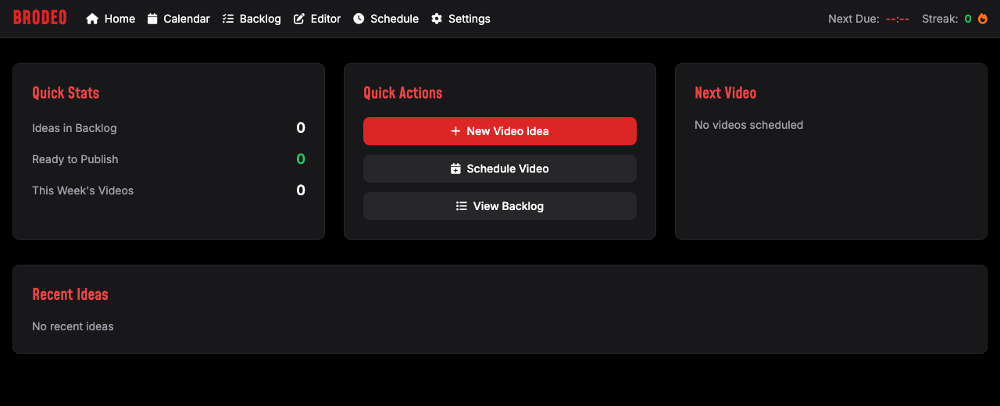

<h1 align="center">🎬 Brodeo</h1>

<b>The planning cockpit for YouTubers who want to stay consistent without dropping quality.</b>

  <a href="https://brodeo.vercel.app"><b>Live at brodeo.vercel.app</b></a>

Consistency is what grows a channel, and it is also the first thing to break when you are a one-person content team. Brodeo puts the whole pipeline on one screen: capture ideas, plan the calendar, generate titles, descriptions and thumbnails with AI, and keep a publishing streak alive.

## Why it exists

Most creators keep ideas in Notes, thumbnails in Canva, titles in their head, and a schedule nowhere. The gap between "I have an idea" and "it is published" is exactly where consistency dies. Brodeo closes that gap by putting idea, plan, assets and schedule in one place, with a streak counter to keep you honest.

## What it does

- **Idea backlog.** Dump every video idea in one place so nothing gets lost.
- **Content calendar and schedule.** See what is going out and when. A "Next Due" clock and streak counter keep you on cadence.
- **AI content generation.** One click drafts titles, descriptions, and thumbnail text, or "generate everything" for a whole video at once.
- **Thumbnail Studio.** A real thumbnail editor: drag-and-drop text, 1000+ Google Fonts, template modes (text only, image only, text over image, and "text behind subject" with automatic background removal), plus AI image generation from a prompt.
- **Streak tracking.** Because the entire point is to keep showing up.

## How it works

Capture ideas in the backlog, let the AI draft the packaging (title, description, thumbnail), design the thumbnail in the studio, drop it on the calendar, and watch your streak grow as you ship.

## Under the hood

Flask backend with OpenAI for the text and image generation, the Google Fonts API for the type library, and a background-removal step for the "text behind subject" thumbnails. Tailwind UI, deployed on Vercel.

## Status

Live at [brodeo.vercel.app](https://brodeo.vercel.app).
